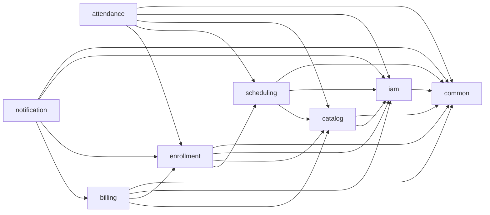

# Arsitektur Modular Monolith

Dokumen ini menetapkan batasan modul inti untuk aplikasi **Boost Spring Boot** agar evolusi fitur tetap terstruktur, dependency tidak berputar (cyclic), dan ownership data jelas.

## Tujuan

- Menetapkan **single ownership** untuk data/domain per modul.
- Menetapkan **API internal** yang boleh dipanggil antar modul.
- Menetapkan **dependency rule** (import/akses kode lintas modul).
- Menyediakan diagram dependency sederhana sebagai guardrail anti-cyclic dependency.

## Modul Inti

1. `iam` (authentication + RBAC)
2. `catalog`
3. `scheduling`
4. `enrollment`
5. `attendance`
6. `billing`
7. `notification`
8. `common`

---

## 1) Modul `iam`

### Tanggung jawab
- Login, refresh token, logout, password reset.
- Manajemen user, role, permission, assignment role-permission.
- Enforcement RBAC untuk akses endpoint/use case.

### Data yang dimiliki
- `users`
- `roles`
- `permissions`
- `user_roles`
- `role_permissions`
- `password_reset_requests`

### Internal service API (boleh dipanggil modul lain)
- `IamAccessService.hasPermission(userId, permission)`
- `IamAccessService.getUserProfile(userId)`
- `IamAccessService.getUserRoles(userId)`
- `IamTokenService.resolvePrincipal(jwtOrRequestContext)`

> Catatan: modul lain **tidak boleh** query tabel IAM secara langsung; gunakan API service IAM.

### Dependency rule
- `iam` boleh import `common`.
- `iam` **tidak boleh** import modul domain lain (`catalog`, `scheduling`, `enrollment`, `attendance`, `billing`, `notification`).
- Modul lain boleh depend ke `iam` hanya lewat interface/service contract internal (bukan lewat repository/entity IAM).

---

## 2) Modul `catalog`

### Tanggung jawab
- Master data akademik: program, course, class group.
- Validasi status aktif/non-aktif dan kapasitas dasar class group.

### Data yang dimiliki
- `programs`
- `courses`
- `class_groups`

### Internal service API (boleh dipanggil modul lain)
- `CatalogQueryService.getProgram(programId)`
- `CatalogQueryService.getCourse(courseId)`
- `CatalogQueryService.getClassGroup(classGroupId)`
- `CatalogPolicyService.ensureClassGroupOpenForEnrollment(classGroupId)`

### Dependency rule
- `catalog` boleh import `common`.
- `catalog` boleh import `iam` hanya untuk kebutuhan authz (mis. method security).
- `catalog` **tidak boleh** import `scheduling`, `enrollment`, `attendance`, `billing`, `notification`.

---

## 3) Modul `scheduling`

### Tanggung jawab
- Perencanaan dan perubahan jadwal sesi kelas.
- Deteksi conflict jadwal instruktur/waktu.
- Menyajikan kalender sesi (`class_sessions`).

### Data yang dimiliki
- `class_sessions`

### Internal service API (boleh dipanggil modul lain)
- `SchedulingQueryService.getSession(sessionId)`
- `SchedulingQueryService.listSessionsByClassGroup(classGroupId, dateRange)`
- `SchedulingPolicyService.ensureSessionOpenForAttendance(sessionId)`
- `SchedulingCommandService.rescheduleSession(sessionId, newStart, newEnd, actor)`

### Dependency rule
- `scheduling` boleh import `common`, `iam`, `catalog`.
- `scheduling` **tidak boleh** import `enrollment`, `attendance`, `billing`, `notification`.

---

## 4) Modul `enrollment`

### Tanggung jawab
- Registrasi siswa ke class group.
- Lifecycle enrollment (`PENDING`, `ACTIVE`, dst) + audit/status history.
- Menjaga aturan idempotency/uniqueness enrollment aktif.

### Data yang dimiliki
- `students`
- `guardians`
- `student_guardians`
- `enrollments`
- `enrollment_status_history`

### Internal service API (boleh dipanggil modul lain)
- `EnrollmentQueryService.getEnrollment(enrollmentId)`
- `EnrollmentQueryService.listActiveEnrollmentByClassGroup(classGroupId)`
- `EnrollmentQueryService.isStudentEnrolled(studentId, classGroupId)`
- `EnrollmentCommandService.changeStatus(enrollmentId, newStatus, actor, reason)`

### Dependency rule
- `enrollment` boleh import `common`, `iam`, `catalog`.
- `enrollment` boleh import `scheduling` untuk validasi jadwal/periode bila dibutuhkan.
- `enrollment` **tidak boleh** import `attendance`, `billing`, `notification`.

---

## 5) Modul `attendance`

### Tanggung jawab
- Pencatatan kehadiran per sesi dan per siswa.
- Validasi bahwa siswa terdaftar aktif pada class group terkait sesi.
- Rekap ringkas kehadiran.

### Data yang dimiliki
- `attendance_records`

### Internal service API (boleh dipanggil modul lain)
- `AttendanceQueryService.getAttendanceRecord(recordId)`
- `AttendanceQueryService.listBySession(sessionId)`
- `AttendancePolicyService.getAttendanceSummary(studentId, classGroupId)`
- `AttendanceCommandService.submitAttendance(sessionId, studentId, status, actor)`

### Dependency rule
- `attendance` boleh import `common`, `iam`, `catalog`, `scheduling`, `enrollment`.
- `attendance` **tidak boleh** import `billing` atau `notification`.

---

## 6) Modul `billing`

### Tanggung jawab
- Pembuatan invoice dan penerimaan payment.
- Tracking status invoice/payment + history perubahan status payment.
- Perhitungan total, paid amount, outstanding.

### Data yang dimiliki
- `invoices`
- `payments`
- `payment_status_history`

### Internal service API (boleh dipanggil modul lain)
- `BillingQueryService.getInvoice(invoiceId)`
- `BillingQueryService.listInvoicesByStudent(studentId)`
- `BillingPolicyService.getOutstandingAmount(studentId)`
- `BillingCommandService.recordPayment(invoiceId, amount, method, actor)`

### Dependency rule
- `billing` boleh import `common`, `iam`, `enrollment`.
- `billing` boleh import `catalog` hanya untuk kebutuhan read-only metadata (opsional).
- `billing` **tidak boleh** import `attendance`, `notification`, `scheduling`.

---

## 7) Modul `notification`

### Tanggung jawab
- Orkestrasi notifikasi lintas domain (email, WA, dsb. sesuai channel).
- Penyimpanan status notifikasi (`QUEUED`, `SENT`, `FAILED`).
- Konsumsi event/outbox dan dispatch ke provider.

### Data yang dimiliki
- `notifications`
- (berbagi penggunaan `outbox_events` melalui fasilitas `common`)

### Internal service API (boleh dipanggil modul lain)
- `NotificationCommandService.enqueueNotification(type, recipient, payload, correlationId)`
- `NotificationQueryService.getNotificationStatus(notificationId)`
- `NotificationCommandService.enqueueBillingReminder(invoiceId)`

### Dependency rule
- `notification` boleh import `common`, `iam`, `enrollment`, `billing`.
- `notification` boleh import `catalog`/`scheduling` hanya untuk template read-only bila perlu.
- `notification` **tidak boleh** menjadi dependency wajib bagi modul domain lain (gunakan event/outbox atau interface async).

---

## 8) Modul `common`

### Tanggung jawab
- Komponen lintas modul yang generic dan tidak berisi business rule domain spesifik.
- Contoh: exception bersama, request context/correlation id, idempotency helper, outbox infrastructure, util observability.

### Data yang dimiliki
- `outbox_events`
- `idempotency_records`
- `audit_log`
- Konfigurasi/infrastruktur bersama (tanpa entitas bisnis domain).

### Internal service API (boleh dipanggil modul lain)
- `OutboxService.publish(aggregateType, aggregateId, eventType, payload, context)`
- `IdempotencyService.execute(idempotencyKey, operation)`
- `AuditLogService.record(actor, action, resource, metadata)`
- `RequestContextService.getCurrentContext()`

### Dependency rule
- `common` **tidak boleh import** modul lain.
- Semua modul boleh import `common`.
- `common` harus tetap kecil, stabil, dan backward-compatible.

---

## Aturan Umum Dependency

1. **Arah dependency harus satu arah** dari modul “atas” ke modul “fondasi”.
2. Antar modul gunakan:
   - interface service internal (prefer), atau
   - event/outbox asynchronous untuk coupling longgar.
3. **Dilarang** akses repository/entity milik modul lain secara langsung.
4. Jika butuh data lintas modul, expose lewat `*QueryService` dari owner modul tersebut.
5. Setiap modul wajib memiliki package boundary yang eksplisit untuk API publik internal vs implementasi privat.

---

## Diagram Dependency (Anti-Cyclic)

### Interpretasi diagram
- Tidak ada edge balik dari `common` ke modul lain.
- Tidak ada pasangan modul dengan dependency dua arah langsung.
- Dependensi lintas domain dibuat bertingkat agar cyclic dependency dapat dihindari sejak desain.

---

## Checklist Enforcement (disarankan)

- Terapkan package convention per modul: `com.example.boost.<modul>...`.
- Tambahkan static architecture test (mis. ArchUnit) untuk memverifikasi rule import.
- Review PR wajib menolak:
  - import implementasi internal modul lain,
  - akses tabel/repository lintas ownership,
  - dependency yang menambah cycle.
